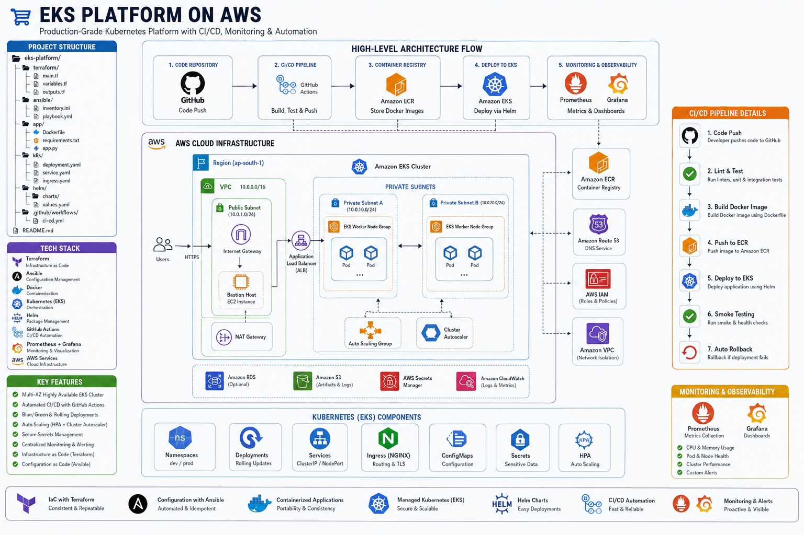

<div align="center">

# 🚀 Production-Grade EKS Platform


<br/><br/>

> **An enterprise-grade, highly available Kubernetes platform provisioned on AWS using Infrastructure as Code (Terraform), automated with Ansible and Helm, fully integrated into a GitHub Actions CI/CD pipeline, and monitored via Prometheus & Grafana.**

</div>

---

## 📌 Platform Overview

This project showcases a production-ready DevOps implementation on Amazon Web Services (AWS), simulating modern enterprise standards:

- **Automated Infrastructure:** Declarative provisioning of AWS VPC networking, EKS clusters, and managed node groups via **Terraform**.
- **Configuration Management:** Bastion host setup, security hardening, and environment orchestration using **Ansible**.
- **Declarative Deployments:** Packaging and lifecycle management of microservices using **Helm charts**.
- **Automated CI/CD:** End-to-end continuous integration and deployment with automated testing, container builds, ECR pushing, and smoke testing via **GitHub Actions**.
- **Full Observability:** Real-time cluster metrics, pod resource utilization, and health visualization with **Prometheus & Grafana**.

---

## 🧱 Architecture Diagram

<p align="center">
  
</p>

### Infrastructure Topology
- **AWS VPC:** Custom multi-AZ VPC with public and private subnets, NAT Gateways, and Internet Gateways.
- **Amazon EKS:** Managed Kubernetes control plane with worker nodes spread across private subnets for high availability.
- **EC2 Bastion Host:** Secure jumpbox configured with Ansible for administrative cluster access.
- **Amazon ECR:** Private, secure container registry storing versioned application images.
- **Ingress Layer:** NGINX Ingress Controller backed by AWS Network Load Balancer (NLB).
- **Persistent Storage & Logs:** S3 buckets and Amazon RDS for stateful workloads and centralized log storage.

---

## ⚙️ Tech Stack & Tooling

| Category | Tools & Technologies |
|---|---|
| **Cloud Provider** | Amazon Web Services (AWS) |
| **Container Orchestration** | Kubernetes (Amazon EKS v1.28+) |
| **Infrastructure as Code** | Terraform 1.5+ |
| **Configuration Management** | Ansible |
| **Containerization & Packaging** | Docker · Helm 3 |
| **CI/CD Automation** | GitHub Actions |
| **Observability & Metrics** | Prometheus · Grafana |
| **Ingress & Networking** | NGINX Ingress Controller · AWS VPC CNI |

---

## 🔄 CI/CD Pipeline Workflow

```
[ Developer Push ] ──► [ GitHub Actions ]
                              │
                              ├── 1. Code Linting & Unit Testing
                              ├── 2. Docker Image Build & Tagging
                              ├── 3. Vulnerability Scan (Trivy)
                              ├── 4. Push Image to Amazon ECR
                              ├── 5. Deploy Helm Chart to EKS (Rolling Update)
                              ├── 6. Automated Health & Smoke Tests
                              └── 7. Automated Rollback on Failure
```

---

## ☸️ Production Kubernetes Features

- **Multi-Environment Isolation:** Dedicated namespaces (`dev`, `prod`, `monitoring`) with strict resource quotas.
- **Auto-Scaling:** Horizontal Pod Autoscaler (HPA) configured based on CPU/Memory thresholds.
- **Zero-Downtime Deployments:** Rolling update strategies with readiness and liveness probes.
- **Configuration & Secret Decoupling:** ConfigMaps for environment variables and encrypted Kubernetes Secrets.
- **Ingress Routing:** Host-based and path-based routing via NGINX Ingress Controller with SSL/TLS termination.

---

## 📊 Monitoring & Observability

- **Prometheus:** Scrapes cluster metrics, node exporter endpoints, and application runtime data.
- **Grafana Dashboards:** Pre-configured visualization dashboards for:
  - Cluster CPU, Memory, and Disk utilization.
  - Pod health, restart frequency, and network I/O.
  - Ingress request rates and error latency distributions.

---

## 📦 Project Structure

```
eks-platform/
├── terraform/               # Terraform modules for VPC, EKS, IAM, and Security Groups
├── ansible/                 # Playbooks for Bastion host and tooling configuration
├── app/                     # Microservice application source code & Dockerfile
├── k8s/                     # Raw Kubernetes manifests (manifest backup)
├── helm/                    # Helm charts for application packaging
└── .github/workflows/       # GitHub Actions CI/CD pipeline definitions
```

---

## ▶️ Getting Started

### Prerequisites
- AWS CLI configured with administrator credentials
- Terraform `>= 1.5.0`
- kubectl and Helm 3 installed locally
- Docker Desktop

### Deployment Steps

```bash
# 1. Provision AWS Infrastructure
cd terraform
terraform init
terraform apply -auto-approve

# 2. Configure Bastion & Tooling
cd ../ansible
ansible-playbook -i inventory playbook.yml

# 3. Connect to EKS Cluster
aws eks update-kubeconfig --region <AWS_REGION> --name <CLUSTER_NAME>

# 4. Deploy Application via Helm
cd ../helm
helm upgrade --install my-app ./my-app-chart --namespace prod --create-namespace
```

---

## 📬 Author & Connect

<div align="center">

**Developed by Rafat Ashraf**  
*Cloud & DevOps Engineer*

[](https://linkedin.com/in/rafat-devops)

</div>
